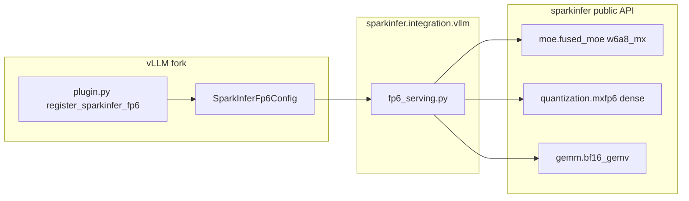

# MX-FP6 vLLM integration

sparkinfer is a **called library**: vLLM does not auto-discover its kernels.
FP4 works today because the maintainer's vLLM fork contains a private shim under
``sparkinfer/integration/`` (``tp_moe.py``, ``mla.py``, ...).  FP6 follows the
same pattern via ``sparkinfer/integration/vllm/``.

## Architecture



## Checkpoint detection

A model is routed to sparkinfer FP6 when **both** are true:

1. ``SPARKINFER_ENABLE_FP6=1`` (legacy ``B12X_ENABLE_FP6`` also accepted)
2. ``config.json`` contains::

       "quantization_config": {
         "quant_method": "modelopt",
         "quant_algo": "W6A6",
         ...
       }

The on-disk tensor layout mirrors ModelOpt NVFP4:

* ``<module>.weight`` — packed FP6 codes ``(out, 3*in/4)`` uint8
* ``<module>.weight_scale`` — UE8M0 block scales, **unswizzled** ``(out, in/32)``
* ``<module>.weight_scale_2`` / ``input_scale`` — unit f32 globals (pure-MX W6A6)

Produce checkpoints with ``scripts/quantize_model_fp6.py``.

## Runtime lifecycle

### Dense linear

1. vLLM loader places packed weights + unswizzled scales into registered params.
2. ``process_weights_after_loading`` swizzles scales once, builds
   ``FP6DenseWeight``, registers ``sparkinfer::fp6_dense_linear``.
3. ``apply`` calls the opaque custom op (CUDA-graph safe).

### MoE (``w6a8_mx``)

1. vLLM expert loader fills ``w13_weight`` / ``w2_weight`` and block scales.
2. ``process_weights_after_loading`` reorders FC1 rows from vLLM's ``[gate; up]``
   to the kernel's ``[up; gate]`` contract, then calls::

       fused_moe.plan_weights(quant_modes="w6a8_mx", source_format="mxfp6_e2m3", ...)
       fused_moe.prepare_weights(...)
3. Each ``apply`` reuses a process-wide scratch cache keyed by ``(M, topk)``::

       plan = fused_moe.plan(Caps(...))
       binding = fused_moe.bind(plan, scratch=..., a=..., experts=..., output=...)
       out = fused_moe.run(binding)

Decode token counts are warm-run at load time so kernels compile and scratch
buffers exist before CUDA-graph capture.

## Maintainer drop-in

Copy (or symlink) these files into the private integration tree of a vLLM fork
that already carries the FP4 glue:

```
sparkinfer/integration/vllm/fp6_serving.py
sparkinfer/integration/vllm/plugin.py
sparkinfer/integration/vllm/__init__.py
```

Register the entry point as documented in
[sparkinfer/integration/vllm/README.md](../sparkinfer/integration/vllm/README.md).

No changes to sparkinfer kernel code are required — the shim only calls the
public ``fused_moe`` and ``quantization.mxfp6`` surfaces validated in Phase 1.

## KLD / determinism

For bit-identical KLD scoring:

```bash
export SPARKINFER_DYNAMIC_DETERMINISTIC_OUTPUT=1
export TORCH_COMPILE_DISABLE=1
```

Run the unchanged ``score_mode_kld.py`` from your KLD fork.  KLD must be
identical across repeated runs; any drift indicates a serving-pipeline bug.

Targets from the pre-rebase baseline: dense W6A8 **0.033389**, MoE W6A8
**0.015043**.

## Out of scope

* FP6 KV-cache (W6A6/8 covers weights + activations only)
* Rebuilding the old monolithic ``tp_moe.py`` workspace machinery (superseded by
  ``plan.scratch_specs()``)
